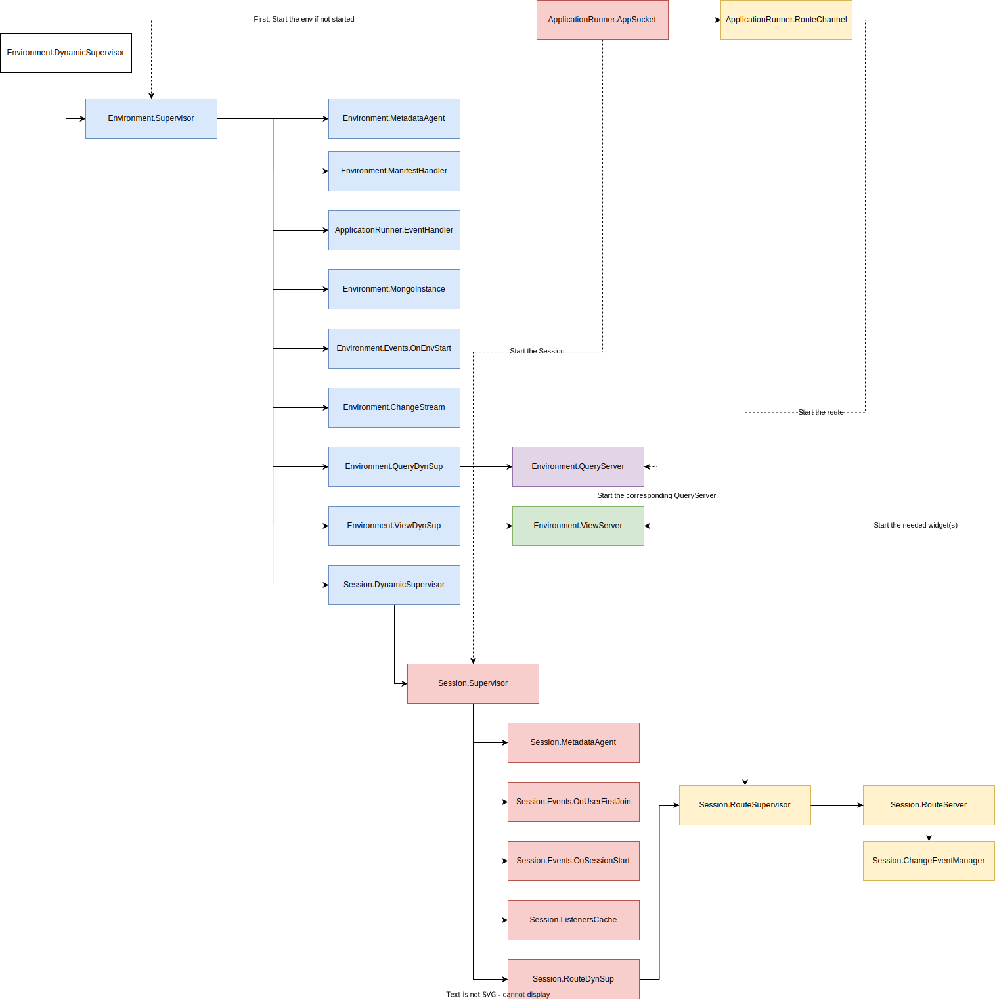
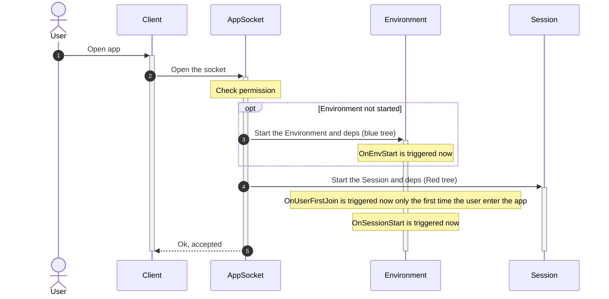
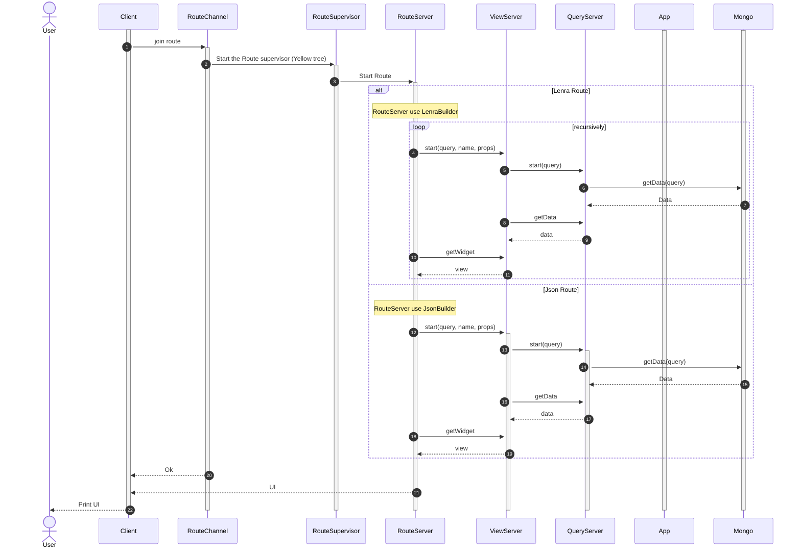
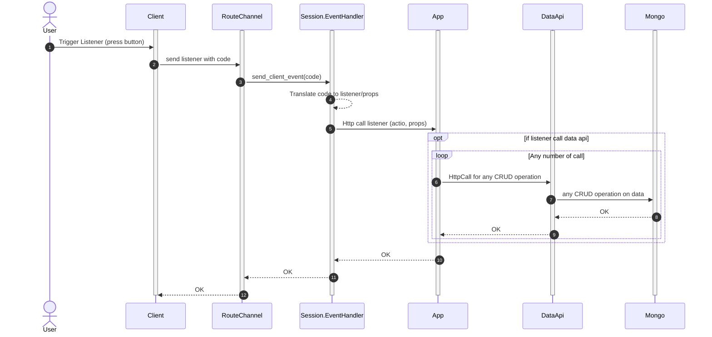
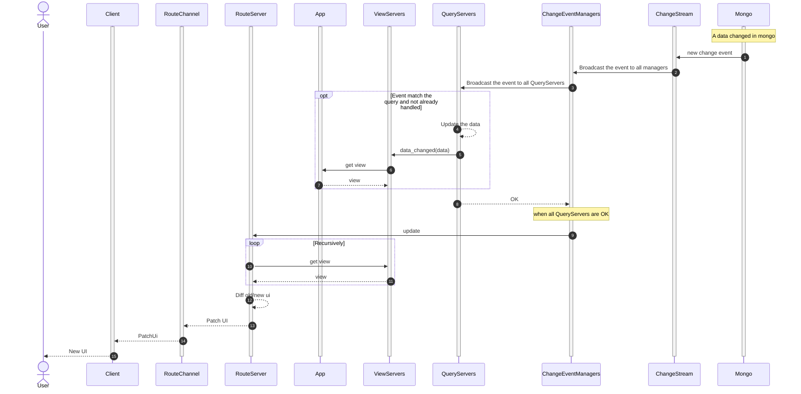

# How does ApplicationRunner works ?

## General tree organisation
### The Environment Tree
The Blue part is the environment tree. It exists only once per environment.
An environment is a specific instance of an app with its own data.
Multiple environments can be created for one app. They behave like two app with two databases.

At session start, we ensure that the environment is started. If the environment is already started, we use it. If not, we start the environment tree by first starting the Environment.Supervisor.

The Supervisor starts all the necessary GenServers:

- Environment.MetadataAgent: This is an agent that works mostly like a GenServer. The agent is here to keep all the metadata and make it accessible from every GenServer in the tree.
- Environment.ManifestHandler: This GenServer gets and caches the manifest of the application. In the manifest, we will find routes, root_view, and other information.
- ApplicationRunner.EventHandler: This GenServer is a queue for all events to send to the application.
- Environment.MongoInstance: This GenServer is used to configure the Mongo connection and make calls to Mongo.
- Environment.Events.*: All the tasks under Events are listeners that run on specific Environment lifetime events.
- Environment.ChangeStream: This GenServer listens for Mongo change events.
- Environment.QueryDynSup: This DynSupervisor starts and handles QueryServer that cache data for a specific query. The query server reacts to ChangeStream to reload data.
- Environment.ViewdynSup: This DynSupervisor starts and handles ViewServer that caches views. They react to QueryServer when the data changes to reload the cache.
- Environment.SessionDynSup: This DynSupervisor starts and handles sessions.

The environment is stopped when all of these sessions are stopped. Each session notifies the Environment Supervisor on stop, and if this is the last session handled, the environment stops.

At stop, we send a request to OpenFaaS to scale to zero all application instances.
### The Session Tree
The red part is the Session Tree. It exists once per user session and lives in an environment
One user can open multiple sessions. 
A session is defined by a unique ID (UUID).

A session can be stopped after a long inactivity time.
If it's the case, the client will open a new session (new socket connexion)

TODO : Explain the full red tree

### The Route tree
The yellow part is the Route Tree. It exists once per route and lives in a session.
A route is basically a UI/JSON that lives under a URI.
For example, the route **/users/42** could display a specific user information (for the Lenra UI) or return a specific JSON (for the JSON routes)

## Start the app
### Socket initialization (simplified)

When the socket is initialized (when the user join the app), we also start the Session (Red tree) and the Environment (Blue tree) if it is not started.

### New Route Channel (simplified)

When the client open a new route, we start the corresponding RouteSupervisor (Yellow tree)
It directly trigger a UI push in this route channel.

## App lifecycle

### When a listener is called (simplified)

When the user interact with the UI, listeners can be sent to the Server.
When a listener is sent, the server will call the App listener to let the app interact with the data.

### When a data change in mongo (simplified)

Generally during a listener call, the mongo data will change.
When this happen, the UI automatically updates.

