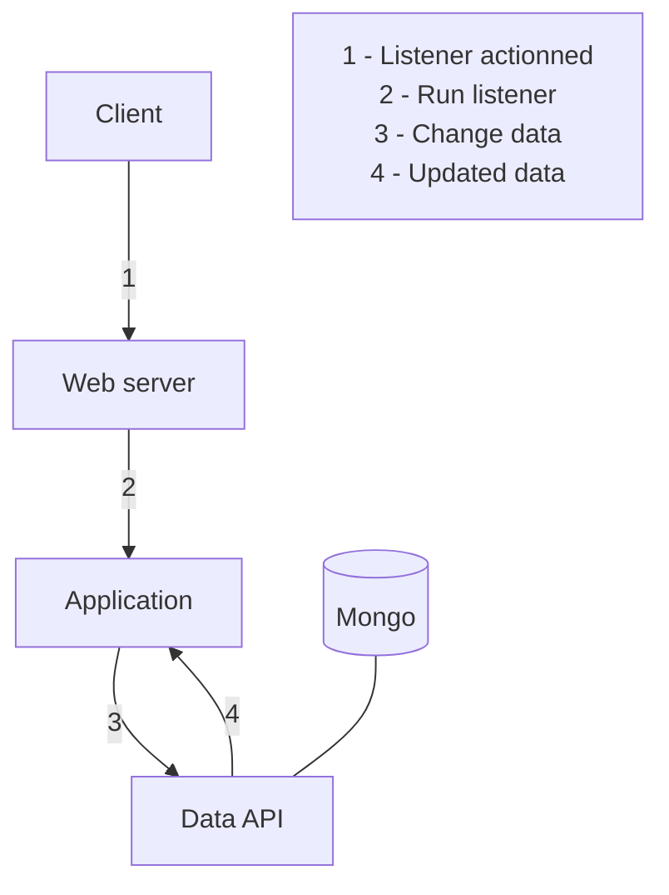
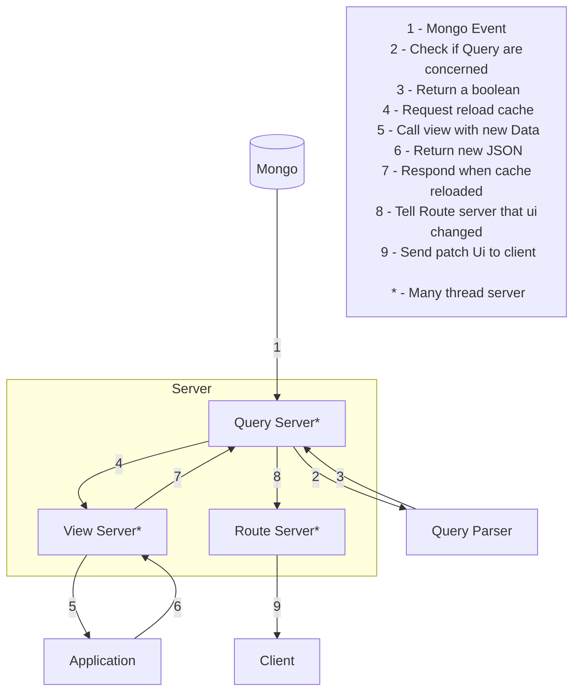

# CRUD

Create a document, give the content in the body
```js
- POST `${api.url}/app/colls/${coll}/docs`
```
Read a specific document
```js
- GET `${api.url}/app/colls/${coll}/docs/${id}`
```
Update a document, give the changes in the body
```js
- PUT `${api.url}/app/colls/${coll}/docs/${doc._id}`
```
Delete a document
```js
- DELETE `${api.url}/app/colls/${coll}/docs/${doc._id}`
```
  
# How listener changes the data



# How are the views reloaded


    
